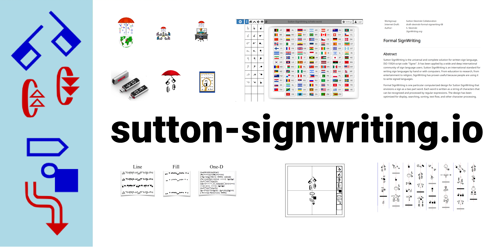

# @sutton-signwriting/sutton-signwriting

[](https://gitter.im/sutton-signwriting/community?utm_source=badge&utm_medium=badge&utm_campaign=pr-badge&utm_content=badge)



Source for [www.Sutton-SignWriting.io](https://www.sutton-signwriting.io).

The site is built using [MkDocs](https://www.mkdocs.org/) and served from the [sutton-signwriting.github.io](https://github.com/sutton-signwriting/sutton-signwriting.github.io) repo.

## Dependencies

To create the documentation website, you need to install mkdocs and npm.

``` bash
pip install mkdocs mdx_gh_links

sudo apt install npm
```

## Documentation
Modify the documentation files as needed.

    mkdocs.yml
    docs/*

## Package Scripts
``` bash
# open server with live updates
npm start

# write website to site directory
npm run build

# write website to ../sutton-signwriting.github.io directory
npm run deploy
```
