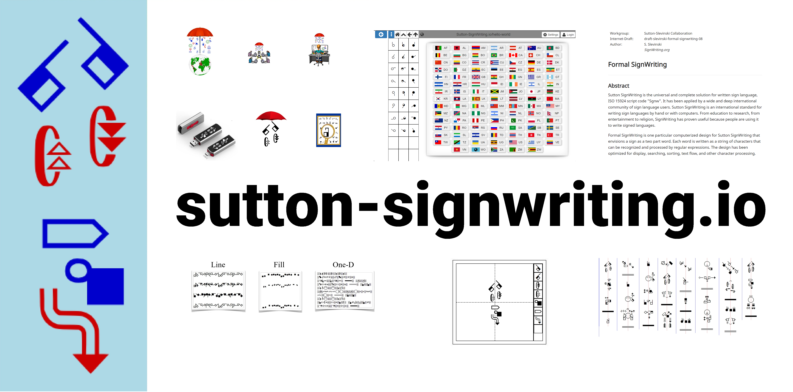
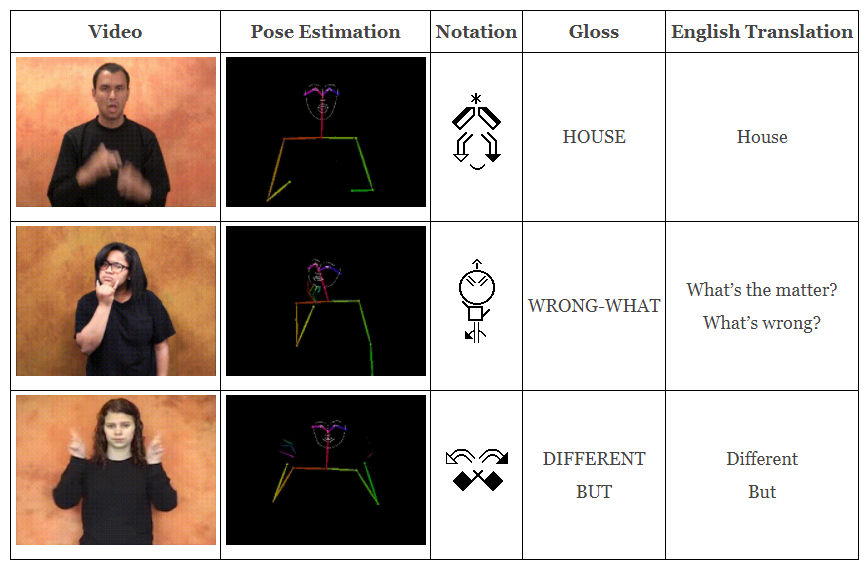
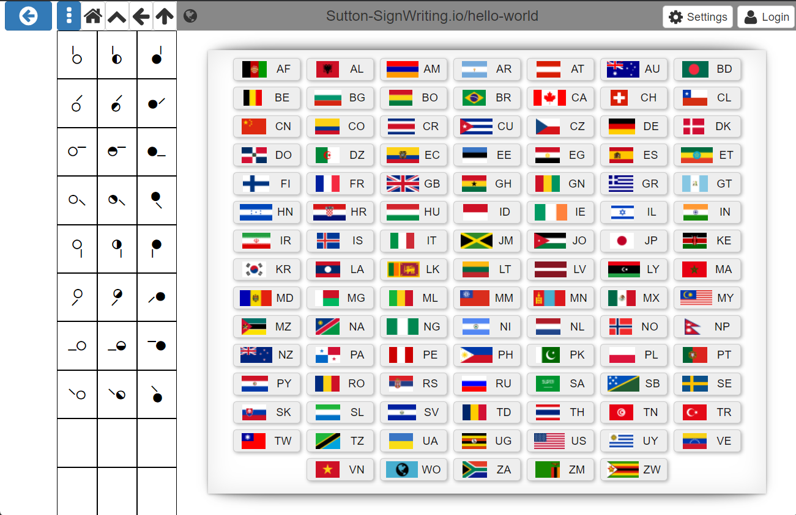
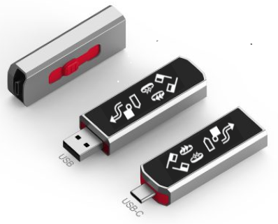

# Sutton SignWriting

<a href="https://signwriting.org/" class="btn btn-primary" role="button">SignWriting.org</a>
<a href="https://www.youtube.com/channel/UCXu4AXlG0rXFtk_5SzumDow" class="btn btn-primary" role="button">SignWriting Stream</a>
<a href="https://gitter.im/sutton-signwriting/community" class="btn btn-primary" role="button">Gitter Chat</a>
<a href="https://www.signwriting.org/forums/swlist/" class="btn btn-primary" role="button">Email List</a>
<a href="https://www.facebook.com/groups/SuttonSignWriting/" class="btn btn-primary" role="button">Facebook Group</a>
<a href="https://en.wikipedia.org/wiki/SignWriting" class="btn btn-primary" role="button">Wikipedia</a>

The Sutton SignWriting script is the universal and complete solution for written
sign language, ISO 15924 script code "Sgnw".  It has been applied by
a wide and deep international community of sign language users.
Sutton SignWriting is an international standard for writing sign
languages by hand or with computers.  From education to research,
from entertainment to religion, SignWriting has proven useful because
people are using it to write signed languages.

Formal SignWriting is one particular computerized design for Sutton SignWriting.
Formal SignWriting envisions a sign as a two-part word of time and space.
Each word is written as a string of characters that can be recognized and
processed by regular expressions. The design has been optimized for
display, searching, sorting, text flow, and other character processing.

www.Sutton-SignWriting.io is a website of information and resources about the Sutton SignWriting script and Formal SignWriting technology.

<a href="https://github.com/sutton-signwriting/sutton-signwriting" class="btn btn-primary" role="button">Source</a>
<a href="https://www.npmjs.com/package/@sutton-signwriting/sutton-signwriting" class="btn btn-primary" role="button">Package</a>
<a href="https://unpkg.com/browse/@sutton-signwriting/sutton-signwriting/" class="btn btn-primary" role="button">Distribution</a>
<a href="https://github.com/sutton-signwriting/sutton-signwriting/archive/refs/heads/main.zip" class="btn btn-primary" role="button">Download</a>

---

## Specification

The Formal SignWriting specification is a faithful encoding of Sutton SignWriting that is documented in an Internet Draft submitted to the IETF.

<a href="https://www.ietf.org/archive/id/draft-slevinski-formal-signwriting-08.txt" class="btn btn-primary" role="button">Text</a>
<a href="https://www.ietf.org/archive/id/draft-slevinski-formal-signwriting-08.html" class="btn btn-primary" role="button">HTML</a>
<a href="https://www.ietf.org/archive/id/draft-slevinski-formal-signwriting-08.xml" class="btn btn-primary" role="button">XML</a>
<a href="https://tools.ietf.org/pdf/draft-slevinski-formal-signwriting-08.pdf" class="btn btn-primary" role="button">PDF</a>
<a href="https://datatracker.ietf.org/doc/html/draft-slevinski-formal-signwriting-08" class="btn btn-primary" role="button">HTMLized</a>
<a href="https://datatracker.ietf.org/doc/draft-slevinski-formal-signwriting/08/bibtex" class="btn btn-primary" role="button">Bibtex</a>

---

## Characters
Any sign can be written as a string of characters.  Formal
SignWriting has two sets of characters that can be used: Formal
SignWriting in ASCII (FSW) and SignWriting in Unicode (SWU).  These
sets are isomorphic with an easy bi-directional conversion between
the two sets.

| Description     | FSW Characters   | SWU Characters     |
|:----------------|:-----------------|:-------------------|
| Sequence Marker | A                | U+1D800            |
| Signbox Markers | B, L, M, R       | U+1D801 to U+1D804 |
| Numbers         | 250 to 749       | U+1D80C to U+1D9FF |
| Symbols         | S10000 to S38b07 | U+40001 to U+4F428 |

<a href="https://www.ietf.org/archive/id/draft-slevinski-formal-signwriting-08.html#name-characters" class="btn btn-primary" role="button">Character Sets</a>
<a href="https://steveslevinski.me/demo/fsw.html" class="btn btn-primary" role="button">FSW Demo</a>
<a href="https://slevinski.github.io/SuttonSignWriting/characters/symbols.html#?ui=en&set=fsw" class="btn btn-primary" role="button">FSW Symbols</a>
<a href="https://steveslevinski.me/demo/swu.html" class="btn btn-primary" role="button">SWU Demo</a>
<a href="https://slevinski.github.io/SuttonSignWriting/characters/symbols.html#?ui=en&set=swu" class="btn btn-primary" role="button">SWU Symbols</a>

---

## Fonts
The TrueType Fonts can be used without installing the fonts on any
platform with font-face statements.  Simply include the
following CSS in any HTML page to access the fonts.

    @font-face {
      font-family: "SuttonSignWritingLine";
      src:
        local('SuttonSignWritingLine'),
        url('https://unpkg.com/@sutton-signwriting/font-ttf@1.0.0/font/SuttonSignWritingLine.ttf') format('truetype');
    }
    @font-face {
      font-family: "SuttonSignWritingFill";
      src:
        local('SuttonSignWritingFill'),
        url('https://unpkg.com/@sutton-signwriting/font-ttf@1.0.0/font/SuttonSignWritingFill.ttf') format('truetype');
    }
    @font-face {
      font-family: "SuttonSignWritingOneD";
      src:
        local('SuttonSignWritingOneD'),
        url('https://unpkg.com/@sutton-signwriting/font-ttf@1.0.0/font/SuttonSignWritingOneD.ttf') format('truetype');
    }

If the fonts are installed, then the system fonts will be used.  If
the fonts are not installed when a SignWriting Font page is opened,
the CSS will cause the fonts to be automatically downloaded to the
browser's cache on the first visit.  Once the fonts are installed in
the browser cache, they will remain there until the browser cache is
emptied.  Any webside that uses this CSS can access the browser
installed font without requesting a new copy.  The fonts are 18 MB,
so the first page view make take a few seconds or longer depending on
your download speed and processor.

<a href="https://slevinski.github.io/SuttonSignWriting/components/fonts.html" class="btn btn-primary" role="button">Reference</a>
<a href="https://github.com/Slevinski/signwriting_2010_tools" class="btn btn-primary" role="button">Development</a>
<a href="https://github.com/Slevinski/signwriting_2010_fonts" class="btn btn-primary" role="button">Source</a>
<a href="https://unpkg.com/browse/@sutton-signwriting/font-ttf@1.2.0/font/" class="btn btn-primary" role="button">Distribution</a>

---

## Production

Sutton SignWriting has several production ready packages available on GitHub, NPM, and Unpkg.

### @sutton-signwriting/core
a javascript package for node and browsers that supports general processing of SignWriting text

<a href="https://www.sutton-signwriting.io/core/" class="btn btn-primary" role="button">Docs</a>
<a href="https://github.com/sutton-signwriting/core" class="btn btn-primary" role="button">Source</a>
<a href="https://www.npmjs.com/package/@sutton-signwriting/core" class="btn btn-primary" role="button">Package</a>
<a href="https://unpkg.com/browse/@sutton-signwriting/core/" class="btn btn-primary" role="button">Distribution</a>

---

### @sutton-signwriting/font-db
a javascript package for node that generates SVG and PNG images for individual symbols and complete signs

<a href="https://www.sutton-signwriting.io/font-db/" class="btn btn-primary" role="button">Docs</a>
<a href="https://github.com/sutton-signwriting/font-db" class="btn btn-primary" role="button">Source</a>
<a href="https://www.npmjs.com/package/@sutton-signwriting/font-db" class="btn btn-primary" role="button">Package</a>
<a href="https://unpkg.com/browse/@sutton-signwriting/font-db/" class="btn btn-primary" role="button">Distribution</a>

---

### @sutton-signwriting/font-ttf
a javascript package for the browser that generates SVG and PNG images for individual symbols and complete signs using TrueType Fonts

<a href="https://www.sutton-signwriting.io/font-ttf/" class="btn btn-primary" role="button">Docs</a>
<a href="https://github.com/sutton-signwriting/font-ttf" class="btn btn-primary" role="button">Source</a>
<a href="https://www.npmjs.com/package/@sutton-signwriting/font-ttf" class="btn btn-primary" role="button">Package</a>
<a href="https://unpkg.com/browse/@sutton-signwriting/font-ttf/" class="btn btn-primary" role="button">Distribution</a>

---

### @sutton-signwriting/sgnw-components
a javascript package for the browser that includes a collection of web components built with https://stenciljs.com/

<a href="https://www.sutton-signwriting.io/sgnw-components/" class="btn btn-primary" role="button">Docs</a>
<a href="https://github.com/sutton-signwriting/sgnw-components" class="btn btn-primary" role="button">Source</a>
<a href="https://www.npmjs.com/package/@sutton-signwriting/sgnw-components" class="btn btn-primary" role="button">Package</a>
<a href="https://unpkg.com/browse/@sutton-signwriting/sgnw-components/" class="btn btn-primary" role="button">Distribution</a>

---

## SignMaker 2022

Sutton SignWriting has one prototype that is ready to use.

### @sutton-signwriting/signmaker
an online editor that can be accessed directly, embedded in an iFrame, and downloaded

<a href="https://www.sutton-signwriting.io/signmaker/" class="btn btn-primary" role="button">Direct</a>
<a href="https://www.sutton-signwriting.io/signmaker/demo.html" class="btn btn-primary" role="button">iFrame</a>
<a href="https://github.com/sutton-signwriting/signmaker/archive/refs/heads/main.zip" class="btn btn-primary" role="button">Download</a>
<a href="https://github.com/sutton-signwriting/signmaker" class="btn btn-primary" role="button">Source</a>
<a href="https://www.npmjs.com/package/@sutton-signwriting/signmaker" class="btn btn-primary" role="button">Package</a>
<a href="https://unpkg.com/browse/@sutton-signwriting/signmaker/" class="btn btn-primary" role="button">Distribution</a>

---

## Machine Learning

Sutton SignWriting is growing in the machine learning communities.

* handwriting recognition of SignWriting
* video to SignWriting
* SignWriting to spoken language
* spoken language to SignWriting

---

### @sign-language-processing
A collection of projects using SignWriting with large datasets and machine learning.

<a href="https://sign-language-processing.github.io/" class="btn btn-primary" role="button">About</a>
<a href="https://github.com/sign-language-processing" class="btn btn-primary" role="button">Projects</a>

### @sign-language-processing/sign-translate
A bi-directional multilingual translation app for desktop and mobile, based on state-of-the-art real-time client side models.

<a href="https://github.com/sign-language-processing/sign-translate" class="btn btn-primary" role="button">Source</a>

### @sign-language-processing/signwriting-annotator
This project aims to transcribe in SignWriting a large vocabulary of single-sign videos in various signed languages.

<a href="https://github.com/sign-language-processing/signwriting-annotator" class="btn btn-primary" role="button">Source</a>
<a href="https://signwriting-annotator.web.app/" class="btn btn-primary" role="button">Help Annotate</a>

---

### @agarsev/visse
The VisSE project ("Visualizando la SignoEscritura", "Visualizing SignWriting") aims to develop tools that ease the use and understanding of SignWriting in the digital world.

<a href="https://github.com/agarsev/visse" class="btn btn-primary" role="button">Source</a>
<a href="https://www.ucm.es/visse" class="btn btn-primary" role="button">Homepage</a>

---

### @andreihirata/SignWriting
Python script for extracting deep learning features from images.

<a href="https://github.com/andreihirata/SignWriting" class="btn btn-primary" role="button">Source</a>

---

### @J22Melody/signwriting-translation
Python scripts to analyze SignWriting text

<a href="https://github.com/J22Melody/signwriting-translation" class="btn btn-primary" role="button">Source</a>

---

## Development

Sutton SignWriting has three coding projects under development.

### @sutton-signwriting/cloud-maker
a collection of scripts and data used together to make a functional Sutton SignWriting Cloud server

<a href="https://github.com/sutton-signwriting/cloud-maker" class="btn btn-primary" role="button">Source</a>

---

### @sutton-signwriting/hello-world
a client-side application with optional connection to a cloud server

<a href="https://github.com/sutton-signwriting/hello-world" class="btn btn-primary" role="button">Source</a>
<a href="https://signpuddle.com/client/" class="btn btn-primary" role="button">Prototype</a>

---

### @sutton-signwriting/portable
utilities to create filesystems, static websites, USB drives, client side applications, and cloud server installations

<a href="https://github.com/sutton-signwriting/portable" class="btn btn-primary" role="button">Source</a>

