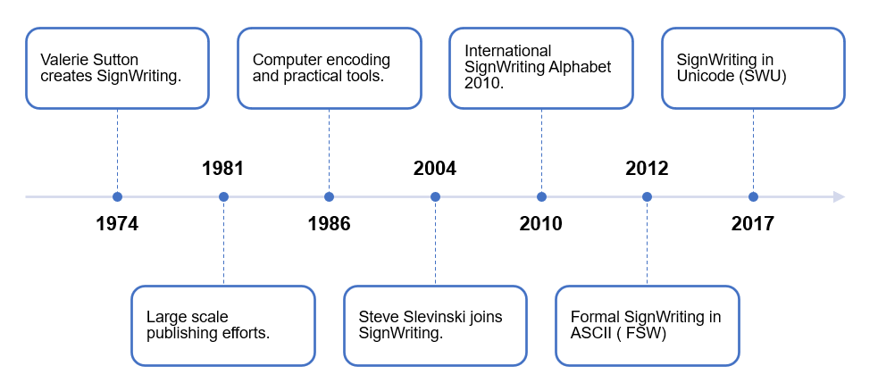

# Sponsors

We support free culture!

## Our Gift

The Sutton SignWriting script is Valerie Sutton's gift to the world.
She first created SignWriting in 1974.
Since then, she has continued to develop, promote, and encourage the use of SignWriting throughout the world.

The Formal SignWriting encoding and infrastructure is Steve Slevinski's gift to the world.
He joined Valerie Sutton in 2004 after several previous generations of writers and developers.
Working together, the Sutton-Slevinski collaboration created the Sutton SignWriting standards of [2010](https://steve.signwriting.org/#standard2010), [2012](https://steve.signwriting.org/#standard2012), and [2017](https://steve.signwriting.org/#standard2017) that we all use today.

Our licenses are  open and permissive, including the Open Font License, MIT, and Creative Commons.
Use of Sutton SignWriting characters, fonts, packages, and data is open to all.
Sutton SignWriting can be used for education, research, fun, and for profit.

---

## Our Request

Use Sutton SignWriting and enjoy.

If you are able, consider financially supporting our efforts.
If you are unable to financially support our efforts, consider asking someone you know who can.

In several ways, money is a limiting factor for what we can accomplish.
We have big dreams for the future and we'd love to bring you more options and better tools.
Fortunately, time is on our side.
SignWriting is inevitable.

Your financial support isn't necessary for SignWriting to succeed, but your support will improve our development speed and quality.

---

## Donations

Our main source of funding to keep the servers running and cover registration fees is through Patreon.

[https://patreon.com/signwriting](https://patreon.com/signwriting)

Donations can also be made with secure payments by Square.

[https://donate.sutton-signwriting.io](https://donate.sutton-signwriting.io)

---

## Crypto

<dl>
  <dt>Bitcoin:</dt>
  <dd>bc1qj0fxphz4qsdt6xd4f3cr4lc96rxyp2ngh0npdp</dd>
  <dt>Ethereum:</dt>
  <dd>0x68733c1Dd7CB5A76d38b0711d937FBb953928357</dd>
  <dt>Dogecoin:</dt>
  <dd>DC8K7qWC7WdTrbDSpAJhFtp3kr9owzMF8j</dd>
</dl>

---

## Thank You

Thank you to all of our readers, writers, and developers.
Future generations will be blessed because of what we do today.

A special thanks to all of our financial supporters.
You help keep the servers running and encourage future growth.
We are honored by those who believe in our work enough to make a financial commitment.
